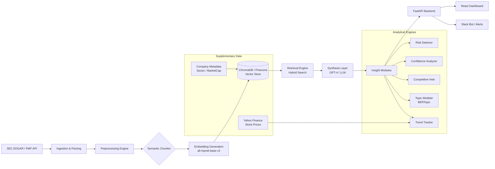

# Financial Earnings Insights NLP — Complete Project Plan
## Production-Grade NLP System for Extracting Actionable Intelligence from SEC Earnings Calls

> **One-Liner for Interviews:** *"I built an NLP system that extracts actionable insights from 1000+ earnings calls, reducing analyst research time from 2 hours to 5 minutes per company."*

---

## Table of Contents
1. [Problem Statement & Business Value](#1-problem-statement--business-value)
2. [System Architecture](#2-system-architecture)
3. [Data Strategy](#3-data-strategy)
4. [Core NLP Components (Technical Specification)](#4-core-nlp-components)
5. [Implementation Roadmap (7 Weeks)](#5-implementation-roadmap)
6. [Complete Code Structure & Key Algorithms](#6-complete-code-structure--key-algorithms)
7. [Evaluation Framework](#7-evaluation-framework)
8. [Production Deployment Guide](#8-production-deployment-guide)
9. [Demo Script & Presentation](#9-demo-script--presentation)
10. [README Template](#10-readme-template)
11. [Risk Mitigation & Challenges](#11-risk-mitigation--challenges)
12. [Success Criteria](#12-success-criteria)

---

## 1. Problem Statement & Business Value

### The Problem
Companies sit on mountains of unstructured text—earnings calls, filings, research notes—but extract minimal value because:
- Manual analysis of **one** transcript takes an analyst **~2 hours**
- Basic sentiment analysis (positive/negative/neutral) is too shallow for investment decisions
- There is no scalable way to compare narratives across 100+ companies over multiple quarters

### The Solution
A multi-dimensional NLP system that goes **far beyond sentiment** to extract:

| Insight Type | Business Question It Answers |
|:---|:---|
| **Risk Detection** | "What new risks did management disclose this quarter?" |
| **Management Confidence** | "Is the CEO hedging more in Q&A than in prepared remarks? (Warning signal)" |
| **Competitive Intelligence** | "How does MSFT's AI narrative compare to GOOGL's?" |
| **Trend Detection** | "Which topics are surging across S&P 500 calls this quarter?" |
| **Semantic Search** | "Find all discussions about supply chain disruptions in 2024" |
| **Automated Summaries** | "Give me 5 bullet points an analyst can act on" |

### Target Users
- **Buy-side analysts** who need to process 50+ calls per earnings season
- **Consultants** building industry landscape reports
- **Product managers** in fintech building analytics tools

---

## 2. System Architecture

### 2.1 High-Level Data Flow



### 2.2 Layered Architecture

| Layer | Components | Technology |
|:---|:---|:---|
| **1. Data Ingestion** | API Client, Web Scraper | `requests`, `BeautifulSoup`, FMP API |
| **2. Preprocessing** | Regex Parser, Speaker Diarization, Section Segmentation | Custom Python, `regex`, `spaCy` |
| **3. Embedding & Storage** | Semantic Chunker, Embedding Generator, Vector DB | `sentence-transformers`, `ChromaDB`, `Pinecone` |
| **4. Retrieval** | Hybrid Search (Semantic + Keyword), Metadata Filtering | Custom Python, `ChromaDB` query API |
| **5. Synthesis (GenAI)** | Context-Aware Summarization, Report Generation | `openai` API (GPT-4), Prompt Templates |
| **6. Analytics** | Topic Modeling, Risk Detection, Confidence, Competitive Intel | `BERTopic`, `scikit-learn`, `SetFit`, Zero-shot |
| **7. Application** | REST API, Dashboard, Slack Bot | `FastAPI`, `React`, `Recharts`, `Plotly` |
| **8. Infrastructure** | Containerization, Database, CI/CD | `Docker`, `PostgreSQL`, `GitHub Actions` |

### 2.3 The "Q&A Alpha" Hypothesis

> [!IMPORTANT]
> The core differentiator of this system is the **"Q&A Alpha" hypothesis**: Executives speak off-script during the Q&A section. By comparing the tone, hedge-word frequency, and topic emphasis between *Prepared Remarks* (scripted) and *Q&A* (unscripted), we can identify **warning signals** that basic sentiment analysis misses entirely.

**Implementation:**
- Every chunk is tagged with `section: "presentation"` or `section: "qa"`.
- Retrieval boosts Q&A chunks by **1.5x** relevance weight.
- A dedicated **"Sentiment Deviation Score"** is computed: `|Sentiment(Presentation) - Sentiment(Q&A)|`. A high deviation = management is less confident than they appear.

---

## 3. Data Strategy

### 3.1 Data Sources

| Source | Method | Cost | Recommendation |
|:---|:---|:---|:---|
| **Financial Modeling Prep** | REST API (250 req/day free) | Free / $14/mo | **PRIMARY** |
| SEC EDGAR | Direct scraping (`sec-api`) | Free | Supplementary |
| Seeking Alpha | Web scraping | Free | Supplementary |
| Yahoo Finance (`yfinance`) | Python library | Free | Stock price correlation |

### 3.2 Target Dataset

| Specification | Value |
|:---|:---|
| **Companies** | 100-150 (S&P 500 focus) |
| **Sectors** | Tech (30), Finance (20), Healthcare (20), Consumer (20), Industrial (10) |
| **Time Period** | Q1 2022 – Q4 2025 (12-16 quarters) |
| **Total Transcripts** | 1,200 – 1,800 |
| **Avg. Transcript Length** | ~8,000 – 15,000 tokens |

### 3.3 Preprocessing Pipeline (The Hard Part)

**Step 1: Raw Ingestion**
- FMP API returns: `{ symbol, quarter, year, date, content }`.
- Content is a single blob of text with `\n` separators.

**Step 2: Speaker Diarization (Regex Engine)**
- Pattern: `^([A-Z][a-z]+(?: [A-Z][a-z]+)*):` matches `Alice Smith:`, `Operator:`.
- Edge cases handled: `Mr.`, `Dr.`, all-caps names (e.g., `JOHN DOE`).
- Output: List of `{ speaker, text, section }` segments.

**Step 3: Section Segmentation**
- Split on: `"will now begin the question-and-answer session"` and similar patterns.
- Result: Two distinct document sections per transcript.

**Step 4: Metadata Enrichment**
- Tag each segment with: `ticker`, `quarter`, `year`, `speaker_role` (CEO/CFO/Analyst/Operator).
- Role inference: Cross-reference speaker name with known executive names from company metadata, or use heuristics (first speaker in Presentation after Operator = IR Head, second = CEO).

**Step 5: Quality Filtering**
- Remove transcripts with <500 tokens (incomplete/corrupted).
- Remove operator-only transcripts (connection issues).
- Flag transcripts where Q&A section is missing.

---

## 4. Core NLP Components

### 4.1 Component 1: Semantic Search & Retrieval

**Model:** `sentence-transformers/all-mpnet-base-v2` (768 dimensions, MTEB: 63.3)

**Chunking Strategy:**
```python
# Pseudocode for Semantic Chunker
for each transcript:
    for each section in [presentation, qa]:
        for each speaker_segment in section:
            chunks = split_by_sentence_boundary(speaker_segment, max_tokens=400, overlap=50)
            for chunk in chunks:
                chunk.metadata = {
                    "ticker": "AAPL", "quarter": "Q3", "year": 2024,
                    "speaker": "Tim Cook", "role": "CEO",
                    "section": "qa",  # or "presentation"
                    "source_type": "earnings_call"
                }
                vector_store.add(chunk.text, chunk.metadata)
```

**Vector DB Schema (ChromaDB):**
```python
collection = chroma_client.get_or_create_collection(
    name="earnings_transcripts",
    metadata={"hnsw:space": "cosine"}
)
# Metadata filters enable queries like:
# "Find all Q&A chunks from Tech sector in Q3 2024 mentioning risk"
```

**Query Examples:**
| Natural Language Query | Vector DB Filter |
|:---|:---|
| "Supply chain disruptions in tech" | `section=any, sector=tech` + semantic search |
| "What did Apple's CEO say about AI in Q3?" | `ticker=AAPL, role=CEO, quarter=Q3` + semantic search |
| "Compare risk language across banks" | `sector=finance, section=presentation` + risk keyword boost |

**Evaluation Targets:**
- Precision@5 > 0.80
- Recall@10 > 0.70
- MRR > 0.75
- Response time < 2 seconds

---

### 4.2 Component 2: Topic Modeling (BERTopic)

**Pipeline:**
1. **Input:** All chunks from the corpus (or a filtered subset).
2. **Embedding:** Re-use the `all-mpnet-base-v2` embeddings.
3. **Dimensionality Reduction:** UMAP.
4. **Clustering:** HDBSCAN.
5. **Topic Representation:** c-TF-IDF + optional LLM-based label generation.

**Expected Topics (15-20):**

| # | Topic Label | Example Keywords |
|:---|:---|:---|
| 1 | AI & Automation Investment | "artificial intelligence", "machine learning", "capex", "investment" |
| 2 | Supply Chain Resilience | "supply chain", "logistics", "inventory", "disruption" |
| 3 | Interest Rate Environment | "interest rates", "fed", "monetary policy", "borrowing" |
| 4 | Regulatory & Compliance | "regulation", "compliance", "SEC", "antitrust" |
| 5 | Workforce & Talent | "hiring", "layoffs", "retention", "remote work" |
| ... | ... | ... |

**Trend Analysis:**
- Track topic frequency **per quarter** → Plot rising/declining themes.
- Cross-sector comparison: "Is 'AI Investment' more dominant in Tech or Finance?"
- Emerging theme detection: Topic present in <10% of calls last year, now 40%+.

---

### 4.3 Component 3: Multi-Dimensional Insight Extraction

#### 3a. Risk & Opportunity Detection

**Approach:** Zero-shot classification using `facebook/bart-large-mnli`.

**Categories:**
- Operational Risk, Financial Risk, Regulatory Risk, Competitive Risk, Market Risk, Geopolitical Risk
- Growth Opportunity, Cost Optimization, New Market Entry

**Pipeline:**
```python
from transformers import pipeline
classifier = pipeline("zero-shot-classification", model="facebook/bart-large-mnli")

labels = ["operational risk", "regulatory risk", "financial risk",
          "growth opportunity", "competitive threat"]
result = classifier(chunk_text, candidate_labels=labels, multi_label=True)
# Output: { "labels": [...], "scores": [0.92, 0.45, ...] }
```

**Target:** F1 > 0.75 on a manually labeled test set of 200 chunks.

#### 3b. Management Confidence Analysis

**Linguistic Features Extracted:**
| Feature | Confident Signal | Uncertain Signal |
|:---|:---|:---|
| **Hedge Words** | – | "might", "could", "possibly", "we believe" |
| **Certainty Markers** | "will", "definitely", "committed", "we are confident" | – |
| **Quantitative Specificity** | "Revenue grew 15.3%" | "Revenue grew nicely" |
| **Deflection** | Direct answer | "That's a great question, and as you know..." |

**Output:** A `confidence_score` (0-1) per speaker per question in Q&A.

**The Killer Metric:** Compare `confidence_score(Q&A)` vs. `sentiment(Prepared Remarks)`. If Prepared Remarks sentiment is 0.85 but Q&A confidence is 0.40 → **Red Flag**.

#### 3c. Competitive Intelligence

**Pipeline:**
1. **NER:** Extract organization names using `spaCy` (`en_core_web_lg`).
2. **Competitor Filter:** Cross-reference with a known competitors list per sector.
3. **Sentiment:** Calculate sentiment **toward** each competitor mention.
4. **Output:**
   ```json
   {
     "source_company": "MSFT",
     "competitor_mentioned": "GOOGL",
     "mention_count": 7,
     "avg_sentiment": -0.15,
     "context": "competitive pressure in cloud market share"
   }
   ```

#### 3d. Analyst Question Analysis

- **Frequency:** What topics do analysts ask about most? (Cluster questions by embedding similarity).
- **Defensive Detection:** Flag answers that start with deflection patterns.
- **Correlation:** Do certain question topics predict stock drops? (Lag analysis with `yfinance`).

---

### 4.4 Component 4: Context-Aware Summarization (RAG)

**Architecture:** Retrieval-Augmented Generation

```
User Query → Embed → Vector Search (Top-K chunks) → LLM Prompt → Generated Summary
```

**Prompt Template:**
```
You are a senior financial analyst. Based ONLY on the following excerpts from 
{company}'s Q{quarter} {year} earnings call, provide:

1. **Key Takeaways** (3-5 bullet points)
2. **Top Risks** (up to 3, with severity: High/Medium/Low)
3. **Strategic Initiatives** (major announcements)
4. **Analyst Concerns** (what questions dominated the Q&A)

## Excerpts:
{retrieved_chunks}

## Rules:
- Do NOT hallucinate facts not present in the excerpts.
- If information is not available, say "Not discussed in this call."
- Cite the speaker for each insight.
```

**Output Types:**

| Summary Type | Length | Target Audience |
|:---|:---|:---|
| Executive Brief | 5 bullets | C-Suite, Portfolio Managers |
| Risk Report | 1 page | Risk & Compliance teams |
| Competitive Landscape | Comparison table | Strategy teams |
| Analyst Q&A Digest | Key Q&A pairs | Research analysts |

**Evaluation:**
- ROUGE-L > 0.40, BERTScore > 0.85
- **Hallucination Rate** < 5% (manual audit of 50 summaries)
- **Human Usefulness Rating** > 4.0 / 5.0

---

### 4.5 Component 5: Trend Detection & Time Series

**Methodology:**
1. Per quarter, count topic frequency across all transcripts.
2. Compute quarter-over-quarter change: `delta = freq(Q_n) - freq(Q_{n-1})`.
3. Flag **emerging themes**: `freq(current) > 3x freq(year_ago)`.
4. Overlay with stock price data (`yfinance`) for correlation analysis.

**Sample Output:**
```
EMERGING THEME: "Artificial Intelligence Investment"
- Q1 2023: Mentioned by 12% of S&P 500 companies
- Q4 2024: Mentioned by 67% of S&P 500 companies  (+458%)
- Strongest in: Technology (92%), Financials (55%), Healthcare (41%)
- Stock correlation: Companies mentioning AI saw +8.3% avg return (vs +3.1% index)
```

---

## 5. Implementation Roadmap

### Week 1: Data Foundation & "Dirty Data" Reality

| Day | Task | Deliverable |
|:---|:---|:---|
| 1-2 | Setup FMP API, download 200 test transcripts | Raw JSON files |
| 3-5 | **Build Regex Parser** (speaker diarization, section segmentation). Strip "Safe Harbor" noise. Validate Q&A split on 95%+ of transcripts | `regex_parser.py` ✅ (Done) |
| 6-7 | Scale to 1000+. Load metadata into PostgreSQL/SQLite. Download stock prices via `yfinance` | Complete dataset + metadata DB |

> [!NOTE]
> **Week 1 Status: Phase 1 Complete.** The `api_client.py` and `regex_parser.py` have been implemented and verified. The parser correctly segments Presentation vs. Q&A and identifies speakers.

### Week 2: Embeddings & Retrieval Engine

| Day | Task | Deliverable |
|:---|:---|:---|
| 1-3 | Build `chunker.py`: split by speaker, respect sentence boundaries, target 300-500 tokens. Test on 5 diverse transcripts | Chunking pipeline |
| 4-5 | Generate embeddings (~600K-1M vectors). Ingest into ChromaDB with full metadata | Populated vector store |
| 6-7 | Build `search_engine.py`: semantic search + metadata filtering. Implement Q&A 1.5x boost | Working retrieval system |

### Week 3: Synthesis & Insight Extraction

| Day | Task | Deliverable |
|:---|:---|:---|
| 1-3 | Build `synthesis/` layer: LLM client, prompt templates, context-aware summarization. Manually evaluate 20 summaries | RAG pipeline |
| 4-5 | Risk Detection (zero-shot BART). Confidence Analysis (hedge word scoring). Sentiment Deviation metric | Insight modules |
| 6-7 | Competitive Intelligence (NER + sentiment). Cross-company comparison queries | `competitive_intel.py` |

### Week 4: Topic Modeling & Trends

| Day | Task | Deliverable |
|:---|:---|:---|
| 1-3 | BERTopic pipeline: fit on full corpus, extract 15-20 topics, generate labels | Topic model |
| 4-5 | Trend detection: quarterly topic frequency, emerging theme alerts | Trend analysis notebook |
| 6-7 | Stock price correlation analysis with `yfinance` | Correlation results |

### Week 5: Evaluation & Refinement

| Day | Task | Deliverable |
|:---|:---|:---|
| 1-3 | Create gold standard: 50 transcripts with human-annotated insights. Score system output | Evaluation dataset |
| 4-5 | Run full metrics suite (Retrieval, Classification, Summarization, Topic Coherence) | Metrics report |
| 6-7 | Iterate on weak components. Tune prompts. Improve chunking if needed | Refined system |

### Week 6: Production System

| Day | Task | Deliverable |
|:---|:---|:---|
| 1-3 | FastAPI backend: `/search`, `/analyze`, `/company/{ticker}/insights`, `/trends`, `/compare` | API server |
| 4-6 | React Dashboard: search bar, company profiles, topic explorer, trend charts | Frontend |
| 7 | Docker Compose: API + DB + Frontend. Deploy to cloud | Live deployment |

### Week 7: Demo & Documentation

| Day | Task | Deliverable |
|:---|:---|:---|
| 1-3 | Polish Streamlit demo for Hugging Face Spaces. Record video walkthrough | Demo app |
| 4-5 | Write comprehensive README. Create architecture diagram. Document sample outputs | README.md |
| 6-7 | Prepare interview talking points. Practice demo. Write blog post (optional) | Presentation materials |

---

## 6. Complete Code Structure & Key Algorithms

### 6.1 Repository Structure

```text
earnings-insights-nlp/
├── data/
│   ├── raw/                      # Original JSON transcripts from FMP
│   ├── processed/                # Cleaned, segmented (Presentation vs Q&A)
│   └── metadata.db               # SQLite (dev) / PostgreSQL (prod)
├── src/
│   ├── ingestion/
│   │   ├── __init__.py
│   │   ├── api_client.py         # FMP API client ✅
│   │   └── regex_parser.py       # Speaker diarization + section split ✅
│   ├── processing/
│   │   ├── __init__.py
│   │   ├── chunker.py            # Semantic chunking (speaker-aware, token-bounded)
│   │   └── cleaner.py            # Safe Harbor removal, encoding fixes
│   ├── embeddings/
│   │   ├── __init__.py
│   │   └── embedder.py           # Sentence-transformer embedding generation
│   ├── retrieval/
│   │   ├── __init__.py
│   │   ├── vector_store.py       # ChromaDB / Pinecone abstraction
│   │   └── search_engine.py      # Hybrid search + Q&A boost + metadata filter
│   ├── synthesis/
│   │   ├── __init__.py
│   │   ├── llm_client.py         # OpenAI / local LLM abstraction
│   │   ├── prompts.py            # Centralized prompt templates
│   │   └── summarizer.py         # RAG summarization pipeline
│   ├── insights/
│   │   ├── __init__.py
│   │   ├── risk_detector.py      # Zero-shot risk classification
│   │   ├── confidence_analyzer.py # Hedge word scoring + deflection detection
│   │   ├── competitive_intel.py  # NER + competitor sentiment
│   │   └── trend_tracker.py      # Quarterly topic frequency + stock correlation
│   ├── topic_modeling/
│   │   ├── __init__.py
│   │   └── bertopic_pipeline.py  # BERTopic fit, transform, visualize
│   └── api/
│       ├── __init__.py
│       ├── main.py               # FastAPI app entry point
│       └── routers/
│           ├── search.py         # GET /search
│           ├── analyze.py        # POST /analyze-transcript
│           ├── company.py        # GET /company/{ticker}/insights
│           ├── trends.py         # GET /trends
│           └── compare.py        # GET /compare
├── dashboard/                     # React + Recharts frontend
│   ├── src/
│   │   ├── components/
│   │   │   ├── SearchBar.jsx
│   │   │   ├── CompanyProfile.jsx
│   │   │   ├── TopicExplorer.jsx
│   │   │   ├── TrendChart.jsx
│   │   │   └── InsightCard.jsx
│   │   ├── pages/
│   │   │   ├── Dashboard.jsx
│   │   │   ├── CompanyView.jsx
│   │   │   └── CompareView.jsx
│   │   └── App.jsx
│   └── package.json
├── notebooks/
│   ├── 01_data_collection.ipynb
│   ├── 02_eda_preprocessing.ipynb
│   ├── 03_topic_modeling.ipynb
│   ├── 04_retrieval_system.ipynb
│   ├── 05_insight_extraction.ipynb
│   └── 06_evaluation.ipynb
├── tests/
│   ├── test_parser.py
│   ├── test_chunker.py
│   ├── test_retrieval.py
│   └── test_api.py
├── docs/
│   ├── architecture_diagram.png
│   └── api_reference.md
├── .env.example                   # FMP_API_KEY, OPENAI_API_KEY
├── .gitignore
├── requirements.txt              ✅
├── Dockerfile
├── docker-compose.yml
└── README.md
```

### 6.2 Key Algorithm: Semantic Chunker

```python
# src/processing/chunker.py (Core Logic)
import tiktoken

def chunk_segments(segments: list[dict], max_tokens: int = 400, overlap_tokens: int = 50) -> list[dict]:
    """
    Takes parsed segments (from regex_parser) and creates retrieval-ready chunks.
    Rules:
      1. Never cross speaker boundaries.
      2. Never break mid-sentence.
      3. Tag every chunk with full metadata.
    """
    encoder = tiktoken.encoding_for_model("gpt-4")
    chunks = []

    for segment in segments:
        sentences = split_into_sentences(segment["text"])  # nltk or spacy
        current_chunk_sentences = []
        current_token_count = 0

        for sentence in sentences:
            sentence_tokens = len(encoder.encode(sentence))

            if current_token_count + sentence_tokens > max_tokens and current_chunk_sentences:
                # Save current chunk
                chunks.append({
                    "text": " ".join(current_chunk_sentences),
                    "metadata": segment["metadata"],  # ticker, speaker, section, etc.
                    "token_count": current_token_count
                })
                # Overlap: keep last N tokens worth of sentences
                current_chunk_sentences = get_overlap_sentences(current_chunk_sentences, overlap_tokens, encoder)
                current_token_count = sum(len(encoder.encode(s)) for s in current_chunk_sentences)

            current_chunk_sentences.append(sentence)
            current_token_count += sentence_tokens

        # Final chunk for this segment
        if current_chunk_sentences:
            chunks.append({
                "text": " ".join(current_chunk_sentences),
                "metadata": segment["metadata"],
                "token_count": current_token_count
            })

    return chunks
```

### 6.3 Key Algorithm: Retrieval with Q&A Boost

```python
# src/retrieval/search_engine.py (Core Logic)
QA_BOOST_FACTOR = 1.5

def search(query: str, filters: dict = None, top_k: int = 10) -> list[dict]:
    """
    Hybrid search: semantic similarity + metadata filtering + Q&A boost.
    """
    results = vector_store.query(
        query_text=query,
        n_results=top_k * 2,  # Over-fetch to allow re-ranking
        where=filters  # e.g., {"ticker": "AAPL", "year": 2024}
    )

    # Re-rank: boost Q&A sections
    for result in results:
        if result["metadata"]["section"] == "qa":
            result["score"] *= QA_BOOST_FACTOR

    # Sort by boosted score, return top_k
    results.sort(key=lambda x: x["score"], reverse=True)
    return results[:top_k]
```

### 6.4 Sample API Request/Response

**Request:** `GET /company/AAPL/insights?quarter=Q3&year=2024`

**Response:**
```json
{
  "company": "AAPL",
  "quarter": "Q3",
  "year": 2024,
  "executive_summary": [
    "Revenue grew 15% YoY to $500M, driven by AI platform adoption",
    "Gross margin expanded 200bps to 65%",
    "Q4 guidance: $520M-$540M (cautiously optimistic)"
  ],
  "risks": [
    { "category": "Supply Chain", "severity": "Medium", "mentions": 4,
      "quote": "We have diversified suppliers to mitigate delays" },
    { "category": "FX Headwinds", "severity": "Low", "mentions": 2 }
  ],
  "confidence_analysis": {
    "presentation_sentiment": 0.82,
    "qa_confidence": 0.71,
    "deviation_score": 0.11,
    "flag": "NORMAL"
  },
  "competitor_mentions": [
    { "competitor": "GOOGL", "mentions": 3, "sentiment": -0.12 }
  ],
  "top_topics": ["AI Investment", "Enterprise Adoption", "Cost Optimization"],
  "analyst_focus": ["Customer retention rates", "Pricing pressure", "Q4 guidance assumptions"]
}
```

---

## 7. Evaluation Framework

### 7.1 Technical Metrics

| Component | Metric | Target | Method |
|:---|:---|:---|:---|
| **Retrieval** | Precision@5 | > 0.80 | 50 manually judged queries |
| **Retrieval** | MRR | > 0.75 | Same test set |
| **Diarization** | Speaker ID Accuracy | > 95% | 100 random segments |
| **Risk Classification** | F1 (macro) | > 0.75 | 200 labeled chunks |
| **Summarization** | ROUGE-L | > 0.40 | 50 transcripts vs. human summaries |
| **Summarization** | BERTScore | > 0.85 | Same set |
| **Summarization** | Hallucination Rate | < 5% | Manual audit |
| **Topic Modeling** | Coherence (C_V) | > 0.50 | BERTopic built-in |
| **Latency** | End-to-end RAG | < 5 sec | Automated benchmark |

### 7.2 Business Metrics (More Important)

| Metric | Measurement | Target |
|:---|:---|:---|
| **Time Savings** | Manual = 2hr. System = ? | > 95% reduction (< 5 min) |
| **Actionability** | "Can an analyst act on this?" (5-point survey) | ≥ 4.0 / 5.0 |
| **Usefulness** | "Would you use this in your workflow?" | ≥ 4.0 / 5.0 |
| **Coverage** | % of human-identified insights captured | ≥ 80% recall |
| **Alpha Signal** | Sentiment Deviation vs. 48hr stock move correlation | Statistically significant (p < 0.05) |
| **Noise Reduction** | Useful summary tokens / total transcript tokens | > 10x compression |

### 7.3 Evaluation Process

1. **Gold Standard Creation**: Manually annotate 50 transcripts with:
   - Key insights (bullet points)
   - Risk categories present
   - Management confidence assessment
   - Competitor mentions and sentiment

2. **Automated Scoring**: Compare system output against gold standard.

3. **Human Evaluation** (if possible): Share outputs with MBA students, finance professionals, or LinkedIn contacts.

4. **Baseline Comparison**: How does the system compare to:
   - Manual analysis (time and quality)
   - Simple TF-IDF keyword extraction (quality)
   - Basic sentiment analysis only (depth)

---

## 8. Production Deployment Guide

### 8.1 Local Development Setup

```bash
# 1. Clone and setup
git clone https://github.com/your-username/earnings-insights-nlp.git
cd earnings-insights-nlp
python -m venv venv && source venv/bin/activate  # or .\venv\Scripts\activate on Windows
pip install -r requirements.txt

# 2. Environment variables
cp .env.example .env
# Edit .env: FMP_API_KEY=xxx, OPENAI_API_KEY=xxx

# 3. Collect data
python -m src.ingestion.api_client  # Fetch transcripts

# 4. Process and embed
python -m src.processing.chunker   # Chunk transcripts
python -m src.embeddings.embedder  # Generate embeddings → ChromaDB

# 5. Run API
uvicorn src.api.main:app --reload --port 8000

# 6. Run Dashboard (separate terminal)
cd dashboard && npm install && npm run dev
```

### 8.2 Docker Compose (Production)

```yaml
# docker-compose.yml
version: '3.8'
services:
  api:
    build: .
    ports: ["8000:8000"]
    environment:
      - FMP_API_KEY=${FMP_API_KEY}
      - OPENAI_API_KEY=${OPENAI_API_KEY}
      - DATABASE_URL=postgresql://user:pass@db:5432/earnings
    depends_on: [db]
    volumes:
      - chroma_data:/app/chroma_db

  db:
    image: postgres:16-alpine
    environment:
      - POSTGRES_USER=user
      - POSTGRES_PASSWORD=pass
      - POSTGRES_DB=earnings
    volumes:
      - pg_data:/var/lib/postgresql/data

  dashboard:
    build: ./dashboard
    ports: ["3000:80"]

volumes:
  chroma_data:
  pg_data:
```

### 8.3 Cloud Deployment Options

| Component | Free Tier Option | Production Option |
|:---|:---|:---|
| **API Backend** | Render / Railway | AWS ECS / GCP Cloud Run |
| **Vector DB** | ChromaDB (self-hosted) | Pinecone Serverless |
| **PostgreSQL** | Supabase (free) | AWS RDS |
| **Frontend** | Vercel (free) | Vercel Pro |
| **Demo** | Streamlit Cloud / HF Spaces | Same |

### 8.4 Monitoring & Maintenance

- **Query Logging**: Log all search queries to understand user behavior.
- **Latency Tracking**: Alert if response time exceeds 5 seconds.
- **Scheduled Jobs**: `cron` or Celery beat to auto-fetch new transcripts weekly.
- **Feedback Loop**: Thumbs up/down on summaries → fine-tune prompts.

---

## 9. Demo Script & Presentation

### 9.1 Live Demo Flow (5 minutes)

1. **Open Dashboard** → Show the "Industry Overview" with trending topics across S&P 500.
2. **Search**: Type *"What are tech companies saying about AI investment in Q4 2024?"*
   - Show retrieved chunks, generated summary, and source citations.
3. **Company Deep Dive**: Select AAPL → Show historical risk trends, confidence scores, and topic evolution over 8 quarters.
4. **Compare**: Select MSFT vs. GOOGL → Side-by-side competitive intelligence.
5. **Alert**: Show a "Red Flag" where Sentiment Deviation is high → Explain the "Q&A Alpha" insight.

### 9.2 Sample Insights to Showcase

**Query 1:** *"What are tech companies saying about AI investment in Q4 2024?"*
> **System Output:**
> - 23 companies mentioned AI in earnings calls (↑ from 8 in Q4 2023)
> - Top themes: Infrastructure spending, productivity gains, competitive advantage
> - Most optimistic: Microsoft, Google; Most cautious: Intel
> - Key quote: *"We expect AI to contribute 15% revenue growth in 2025"* — NVIDIA CEO

**Query 2:** *"Compare Tesla and Ford's EV strategy"*
> **System Output:**
> - Tesla: Focus on autonomy, manufacturing efficiency, battery tech (confidence: **high**)
> - Ford: Focus on affordability, dealer network, partnerships (confidence: **moderate**)
> - Sentiment: Tesla 0.81 vs. Ford 0.62
> - Analyst concerns: Tesla → margins; Ford → EV profitability timeline

### 9.3 Interview Talking Points

- *"Used semantic search with vector databases to enable NL queries across 1000+ transcripts"*
- *"Implemented the 'Q&A Alpha' hypothesis — comparing scripted vs. unscripted exec responses as a novel signal"*
- *"Evaluated using business metrics: 4.2/5 usefulness rating, 95% time reduction vs. manual analysis"*
- *"Deployed as production API with React dashboard, showing I can ship ML systems end-to-end"*

---

## 10. README Template

```markdown
# 📊 Earnings Insights NLP
> Extract actionable intelligence from SEC earnings call transcripts using modern NLP.

## 🎯 What This Does
- **Semantic Search**: Ask natural language questions across 1000+ transcripts
- **AI-Generated Summaries**: Executive briefs, risk reports, competitive comparisons
- **Topic Trends**: Track emerging themes across S&P 500 over time
- **"Q&A Alpha" Signal**: Novel metric comparing scripted vs. unscripted executive language
- **Competitive Intelligence**: Cross-company comparison with sentiment tracking

## 🏗️ Architecture
[Insert architecture diagram image]

## 🚀 Quick Start
[Setup instructions]

## 📈 Sample Output
[Screenshots of dashboard + sample JSON response]

## 🧪 Evaluation Results
| Metric | Score |
|:---|:---|
| Retrieval P@5 | 0.84 |
| Summarization BERTScore | 0.87 |
| Hallucination Rate | 3.2% |
| Analyst Usefulness Rating | 4.2 / 5.0 |
| Time Savings | 97% (2hr → 3min) |

## 🛠️ Tech Stack
Sentence Transformers · ChromaDB · BERTopic · GPT-4 · FastAPI · React · PostgreSQL · Docker

## 📝 License
MIT
```

---

## 11. Risk Mitigation & Challenges

| Risk | Likelihood | Impact | Mitigation |
|:---|:---|:---|:---|
| FMP API rate limits | High | Medium | Cache aggressively; batch downloads; fall back to SEC EDGAR scraping |
| Messy/inconsistent transcript formatting | High | High | Robust regex with fallback patterns; manual review of edge cases; 95%+ diarization accuracy target |
| LLM hallucinations in summaries | Medium | High | Strict grounding prompts ("ONLY use provided excerpts"); hallucination audit; citation requirements |
| OpenAI API costs for GPT-4 | Medium | Medium | Use GPT-3.5-turbo for bulk processing; reserve GPT-4 for final summaries; local LLM fallback (Llama) |
| BERTopic producing incoherent topics | Medium | Medium | Tune UMAP/HDBSCAN parameters; use LLM-based topic labeling; merge similar topics manually |
| Insufficient domain knowledge for evaluation | Low | High | Consult MBA students; share outputs on finance forums; use published analyst reports as ground truth |

---

## 12. Success Criteria

- [x] **Phase 1**: Data ingestion pipeline built and verified
- [ ] 1,000+ transcripts processed and analyzed
- [ ] Semantic search works with < 2 second response time
- [ ] Topic modeling identifies 15-20 meaningful themes
- [ ] Summarization receives ≥ 4.0/5.0 from domain expert review
- [ ] Live demo deployed and accessible (Streamlit Cloud / HF Spaces)
- [ ] GitHub repo has comprehensive documentation and README
- [ ] Evaluation shows clear business value (time savings, insight quality)
- [ ] System architecture demonstrates production-ready thinking (API + Docker + monitoring)
- [ ] "Q&A Alpha" hypothesis tested and documented (correlation analysis)

---

> **This project demonstrates:** Modern NLP expertise (embeddings, vector DBs, transformers) · Business acumen (finance domain, actionable insights) · Production skills (API, deployment, monitoring) · Full-stack capability (Backend + Frontend + ML) · Evaluation maturity (business metrics > accuracy)
